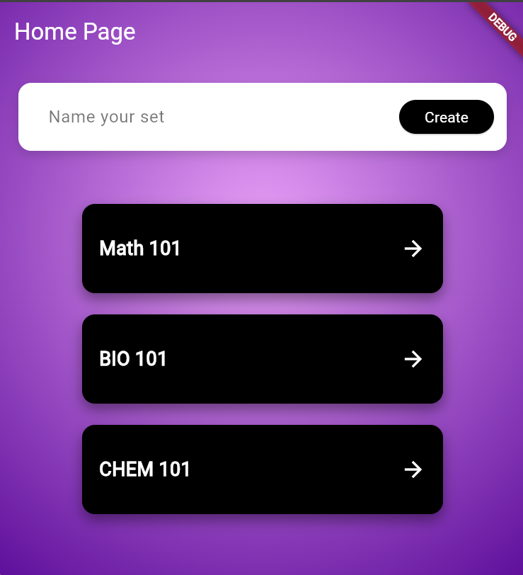
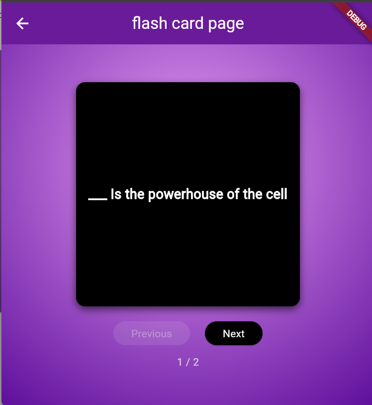

# 📚 Study App

A simple and interactive **Flash Card App** designed to help users study efficiently using active recall. Users can flip cards and navigate between them.

---

## 🎥 Demo

### App Walkthrough  

---

## 🖼️ Screenshots

### Make Study Sets 

### Test Your Knowledge  

---

## ✨ Features

- Organize flash cards by subject
- View flash cards one at a time  
- Flip cards to reveal answers  
- Navigate between cards (Next / Previous)  

---

## 🛠️ Built With

- Flutter  
- Dart  

---
